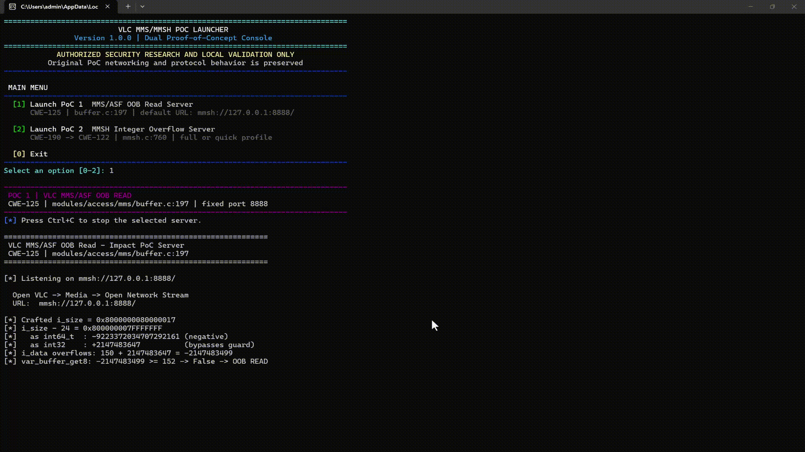

# VLC 3.0.23 - 'MMS/MMSh' OOB & Integer Overflow PoCs

combined Proof-of-Concept launcher for two VLC MMS/MMSh memory-safety research cases.
[](https://t.me/ThreatSignal)



## PoCs

### 01 — MMS/ASF OOB Read

**CWE-125**

```text
modules/access/mms/buffer.c:197
```

The PoC delivers a crafted ASF header through an MMSh-over-HTTP response.

Key characteristics:

```text
MMSh chunk type : 0x4824
Payload size    : 150 bytes
Trigger         : 0x8000000080000017
Default port    : 8888
```

Test endpoint:

```text
mmsh://127.0.0.1:8888/
```

---

### 02 — MMSh Integer Overflow → Heap OOB Write

**CWE-190 → CWE-122**

```text
modules/access/mms/mmsh.c:760
```

The PoC models the `i_header` accumulation path using repeated MMSh chunks.

Core parameters:

```text
BUFFER_SIZE        = 65536
MAX_CK_DATA        = 65524
CHUNKS_TO_OVERFLOW = 65550
CHUNKS_QUICK       = 100
Default port       = 8889
```

Test endpoint:

```text
mmsh://127.0.0.1:8889/
```

Profiles:

```text
FULL  → 65,550 chunks
QUICK → 100 chunks
```

---
